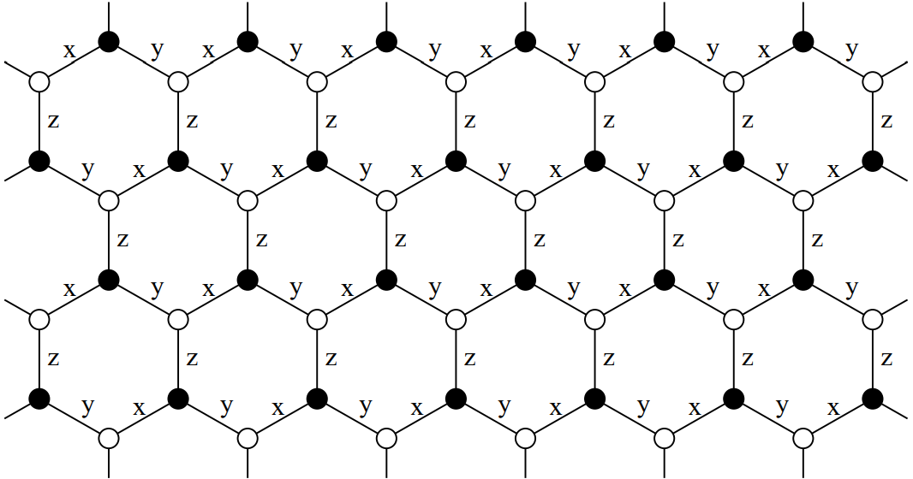

```@meta
CurrentModule = QuantumLattices
DocTestFilters = [r"im +[-\+]0\.0[-\+]"]
DocTestSetup = quote
    using QuantumLattices
end
```

# [5. Couplings and Terms](@id TutorialCouplings)

Now we arrive at the final step toward completely describing a quantum lattice system: the terms that represent the couplings among different degrees of freedom.

## 5.1 Ingredients of Terms in Hamiltonians

In this package, the type [`Term`](@ref) is the representation of a term in a lattice Hamiltonian.

As is well-known, different quantum lattice models have different terms. For example, the [Hubbard model](https://en.wikipedia.org/wiki/Hubbard_model) consists of a usual hopping term $t\sum_{\langle ij\rangle}c^\dagger_ic_j + \text{h.c.}$ and a Hubbard term $U\sum_i c^\dagger_{i\uparrow} c_{i\uparrow} c^\dagger_{i\downarrow}c_{i\downarrow}$, while the [transverse-field Ising model](https://en.wikipedia.org/wiki/Transverse-field_Ising_model) contains an Ising term $J\sum_{\langle ij\rangle}S^z_iS^z_j$ as well as a transverse-field term $h\sum_iS^x_i$. Despite the rich diversity of terms in quantum lattice models, they share common ingredients:

* **Overall coefficient**: Every term has an overall coefficient, e.g., the hopping amplitude $t$ for the usual hopping term, the Hubbard interaction strength $U$ for the Hubbard term, etc.
* **Kind of bonds to be summed over**: As a natural result of lattice symmetry, every term contains a summation over some kind of generic bonds, e.g., the usual hopping term sums over the nearest-neighbor bonds $\langle ij\rangle$, the Hubbard term sums over all individual points (namely the 1-point bonds), etc.
* **Coupling pattern**: In the body of the summation over bonds, every term contains a coupling pattern that can be represented by a certain combination of operators, e.g., the coupling pattern of the usual hopping term can be represented by $c^\dagger_ic_j$, of the Hubbard term can be represented by $c^\dagger_{i\uparrow} c_{i\uparrow} c^\dagger_{i\downarrow}c_{i\downarrow}$, etc.
* **Hermiticity**: To guarantee that the Hamiltonian is Hermitian, the Hermitian conjugate (h.c.) of non-Hermitian terms must be added, e.g., the Hermitian conjugate of the usual hopping term must be added in the expression of the lattice Hamiltonian, while that of the Hubbard term need not.
* **Bond-dependent amplitude** (optional): The amplitude of a term can depend on the generic bonds, e.g., the staggered local chemical potential $\Delta\sum_i(-1)^ic^\dagger_ic_i$ depends on the site index of a point, the $p+ip$ pairing potential $\Delta\sum_{\langle ij\rangle}e^{i\phi_{ij}}c^\dagger_ic^\dagger_j + \text{h.c.}$ depends on the azimuth angle $\phi_{ij}$ of the bond $\langle ij\rangle$, etc.

Such common ingredients determine the underlying organization of [`Term`](@ref). In fact, all of them manifest themselves in the basic construction function of [`Term`](@ref) shown as follows:
```julia
Term{termkind}(
    id::Symbol, value, bondkind, coupling, ishermitian::Bool;
    amplitude::Union{Function, Nothing}=nothing
) where termkind
```
where `termkind` must be a `Symbol`, `value` is the overall coefficient which should be real-valued, i.e., either a real number or a symbolic expression declared to be real (such as `symbols("t", real=true)`), `bondkind` specifies the bonds to be summed over, `coupling` specifies the coupling pattern of the term which can accept an instance of [`Coupling`](@ref), or an iterator of [`Coupling`](@ref)s, or a function that returns a [`Coupling`](@ref) or an iterator of [`Coupling`](@ref)s, `ishermitian` is a boolean indicating whether the term is Hermitian, and the keyword argument `amplitude` specifies the bond dependency of the amplitude if it is not `nothing`. Here, the new type [`Coupling`](@ref) is the building block of the coupling pattern, which will be discussed in detail in the following section. Note that an extra `id` is also assigned to each term for fast lookup.

## 5.2 Coupling Patterns

Before discussing [`Term`](@ref) further, we first turn to the coupling patterns, which lie at the center of the construction of [`Term`](@ref)s.

### 5.2.1 Coupling: Building Block of Coupling Patterns

[`Coupling`](@ref) uses a set of [`Index`](@ref)es together with a coefficient to represent the coupling pattern, as the following construction function implies:
```julia
Coupling([value, ]indexes::Index...)
```
Here, when `value` is omitted, it will be set to `1`.

Let's see a typical example, which represents the coupling pattern of the usual hopping term $t\sum_{⟨ij⟩}c^†_ic_j + h.c.$:
```jldoctest HM
julia> Coupling(Index(1ˢᵗ, FockIndex(:, :, 2)), Index(2ⁿᵈ, FockIndex(:, :, 1)))
∑[𝕕⁺(1ˢᵗ, :, :) 𝕕(2ⁿᵈ, :, :)]
```
There are several differences in the [`Index`](@ref)es here compared to those introduced in [Chapter 3](@ref TutorialDOF):
* **The `site` attributes are not the site indexes of the points in a lattice, instead, they are the ordinals of the points contained in a bond**. In fact, in the expression of $c^\dagger_ic_j$, $i$ is always the first site of a bond while $j$ is always the second, thus, the `site` attributes here are `1ˢᵗ` and `2ⁿᵈ` for the first [`Index`](@ref) and the second [`Index`](@ref), respectively. Here, `1ˢᵗ` and `2ⁿᵈ` are instances of [`Ordinal`](@ref), and an arbitrary ordinal can be obtained by an integer followed by the corresponding special constants, e.g., `1ˢᵗ`, `2ⁿᵈ`, `3ʳᵈ`, `4ᵗʰ`, `5ᵗʰ`, etc. In the REPL or in an editor with tab completion, these superscripts are typed as `\^s<tab>\^t<tab>` (`ˢᵗ`), `\^n<tab>\^d<tab>` (`ⁿᵈ`), `\^r<tab>\^d<tab>` (`ʳᵈ`) and `\^t<tab>\^h<tab>` (`ᵗʰ`); the constructor [`Ordinal`](@ref) is the ASCII alternative, e.g., `Ordinal(5) == 5ᵗʰ`.
* The `internal` attributes are initialized by special [`FockIndex`](@ref) instances, which do not have the type parameter `:f` or `:b` to specify the statistics, and whose `orbital` and `spin` attributes are initialized by the `:` operator rather than integers. **Without the statistics of `:f` or `:b`, [`FockIndex`](@ref) can suit both fermionic and bosonic quantum lattice systems**, as the coupling pattern of a usual hopping term is the same for both kinds of systems. Here, `𝕕` (\bbd<tab>) and `𝕕⁺` (\bbd<tab>\^+<tab>) are the functions that are convenient for constructing and displaying instances of [`FockIndex`](@ref) suitable for both fermionic and bosonic statistics. **When the `:` operator is used in the initialization for either the `orbital` or the `spin` attribute, the default rule applies in the coupling pattern, that orbitals or spins are summed diagonally**, i.e., $c^\dagger_ic_j\equiv\sum_{\alpha\sigma}c^\dagger_{i\alpha\sigma}c_{j\alpha\sigma}$. This rule is in fact a tradition in the literature of condensed matter physics. This implicit summation in the construction of a [`Coupling`](@ref) is made explicit in its string representation by the $\sum$ symbol, as can be seen in the above example.

Similarly, **the total spin of [`SpinIndex`](@ref) can be omitted during the construction of the coupling patterns of spin terms, meaning that it suits any allowable value of total spins**, e.g., the coupling pattern of the spin-flip term of any total spin $J\sum_{⟨ij⟩}S^+_iS^-_j + h.c.$ is as follows:
```jldoctest
julia> Coupling(1//2, Index(1ˢᵗ, SpinIndex('+')), Index(2ⁿᵈ, SpinIndex('-')))
1//2 𝕊(1ˢᵗ, '+') 𝕊(2ⁿᵈ, '-')
```
Note that in this coupling pattern, there is no summation symbol `∑` in the string representation because all indexes are definite. Therefore, **the summation symbol `∑` in the string representation of a coupling pattern only reflects the summation over local internal degrees of freedom, but not the summation over bonds**.

**The diagonal summation rule also applies to the `direction` attribute of [`PhononIndex`](@ref) if initialized by the `:` operator**, e.g., the coupling pattern of the phonon kinetic term $\frac{1}{2M}\sum_i p^2_i$ can be constructed as:
```jldoctest HM
julia> Coupling(𝕡(1ˢᵗ, :), 𝕡(1ˢᵗ, :))
∑[𝕡(1ˢᵗ, :) 𝕡(1ˢᵗ, :)]
```

Of course, more specific coupling patterns can be initialized with more specific internal indexes, e.g., the coupling pattern of the orbital-1 spin-down hopping term of fermions $t\sum_{⟨ij⟩}c^†_{i, 1, ↓}c_{j, 1, ↓} + h.c.$ is
```jldoctest HM
julia> Coupling(𝕔⁺(1ˢᵗ, 1, -1//2), 𝕔(2ⁿᵈ, 1, -1//2))
𝕔⁺(1ˢᵗ, 1, -1//2) 𝕔(2ⁿᵈ, 1, -1//2)
```

When all [`Index`](@ref)es are of the same type, a [`Coupling`](@ref) can be initialized in different simpler ways:
```julia
# Coupling pattern for Fock systems
Coupling{F}(
    [value, ]
    sites::Union{NTuple{N, Ordinal}, Colon},
    orbitals::Union{NTuple{N, Int}, Colon},
    spins::Union{NTuple{N, Union{Rational{Int}, Int}}, Colon},
    nambus::NTuple{N, Int}
) where {N, F<:FockIndex}

# Coupling pattern for spin systems
Coupling{S}(
    [value, ]
    sites::Union{NTuple{N, Ordinal}, Colon},
    tags::NTuple{N, Char}
) where {N, S<:SpinIndex}

# Coupling pattern for phonon systems
Coupling{P}(
    [value, ]
    sites::Union{NTuple{N, Ordinal}, Colon},
    directions::Union{NTuple{N, Char}, Colon}
) where {N, P<:Union{PhononIndex{:u}, PhononIndex{:p}}}
```
Here, as usual, when `value` is omitted, the coefficient of the [`Coupling`](@ref) will be set to 1.

See examples:
```jldoctest HM
julia> Coupling{FockIndex}((1ˢᵗ, 1ˢᵗ, 2ⁿᵈ, 2ⁿᵈ), :, :, (2, 2, 1, 1))
∑[𝕕⁺(1ˢᵗ, :, :) 𝕕⁺(1ˢᵗ, :, :) 𝕕(2ⁿᵈ, :, :) 𝕕(2ⁿᵈ, :, :)]

julia> Coupling{SpinIndex}((1ˢᵗ, 2ⁿᵈ), ('z', 'z'))
𝕊(1ˢᵗ, 'z') 𝕊(2ⁿᵈ, 'z')

julia> Coupling{PhononIndex{:p}}((1ˢᵗ, 1ˢᵗ), :)
∑[𝕡(1ˢᵗ, :) 𝕡(1ˢᵗ, :)]
```

A [`Coupling`](@ref) can be multiplied with a number:
```jldoctest
julia> coupling = Coupling(1//2, 𝕊(1ˢᵗ, '+'), 𝕊(2ⁿᵈ, '-'));
 
julia> coupling * 3
3//2 𝕊(1ˢᵗ, '+') 𝕊(2ⁿᵈ, '-')
 
julia> 3 * coupling
3//2 𝕊(1ˢᵗ, '+') 𝕊(2ⁿᵈ, '-')
```

Two [`Coupling`](@ref)s can be multiplied together:
```jldoctest
julia> cp₁ = Coupling{FockIndex}((1ˢᵗ, 1ˢᵗ), :, (1//2, 1//2), (2, 1));
 
julia> cp₂ = Coupling{FockIndex}((1ˢᵗ, 1ˢᵗ), :, (-1//2, -1//2), (2, 1));
 
julia> cp₁ * cp₂
∑[𝕕⁺(1ˢᵗ, :, 1//2) 𝕕(1ˢᵗ, :, 1//2)] ⊗ ∑[𝕕⁺(1ˢᵗ, :, -1//2) 𝕕(1ˢᵗ, :, -1//2)]
```

Note that due to the implicit summation of the orbital index in the coupling pattern, the above product is not equal to the coupling pattern of the Hubbard term $U\sum_i c^\dagger_{i\uparrow} c_{i\uparrow} c^\dagger_{i\downarrow}c_{i\downarrow}$:
```jldoctest
julia> cp₁ = Coupling{FockIndex}((1ˢᵗ, 1ˢᵗ), :, (1//2, 1//2), (2, 1));
 
julia> cp₂ = Coupling{FockIndex}((1ˢᵗ, 1ˢᵗ), :, (-1//2, -1//2), (2, 1));
 
julia> cp = Coupling{FockIndex}((1ˢᵗ, 1ˢᵗ, 1ˢᵗ, 1ˢᵗ), :, (1//2, 1//2, -1//2, -1//2), (2, 1, 2, 1)) # Hubbard coupling pattern
∑[𝕕⁺(1ˢᵗ, :, 1//2) 𝕕(1ˢᵗ, :, 1//2) 𝕕⁺(1ˢᵗ, :, -1//2) 𝕕(1ˢᵗ, :, -1//2)]
 
julia> cp == cp₁ * cp₂
false
```

### 5.2.2 Default Rules in Coupling Patterns

As has been shown in the previous subsection, some attributes of the `internal` attribute of [`Index`](@ref) can be initialized by the `:` operator during the construction of a coupling pattern. For the `orbital` and `spin` attributes of [`FockIndex`](@ref), and for the `direction` attribute of [`PhononIndex`](@ref), the default rule is that such indexes will be summed diagonally in the coupling pattern. In fact, the `site` attribute of [`Index`](@ref) also supports the `:` initialization, but with different default rules.

Let's return to the example of the coupling pattern of the usual hopping term, i.e., $c^\dagger_ic_j$. Apparently, the `site` attributes are always `(1ˢᵗ, 2ⁿᵈ)` as long as the coupling pattern belongs to an usual hopping term. In fact, for most common terms in condensed matter, such attributes in the coupling pattern usually depend only on their kinds rather than the concrete instances. Therefore, we could define them outside the construction functions of [`Coupling`](@ref) or [`Term`](@ref) by separate functions, and just leave them to the default rules.

All predefined default rules can be found in the section of [Specialized Terms](@ref SpecializedTerms). **If you need a term that is beyond such default rules, or you just think that such rules are too complicated to remember, it is recommended to explicitly write them out in the coupling pattern.**

### 5.2.3 Coupling Patterns with Constraints

The default rules cannot handle complicated summation conditions on the local internal degrees of freedom in the coupling pattern. For example, for the interorbital-interspin Hubbard term in a [multi-orbital Hubbard model](https://www.annualreviews.org/doi/abs/10.1146/annurev-conmatphys-020911-125045), which can be written as $U\sum_i\sum_{α<β\,\text{and}\,σ≠σ′} c^†_{iασ} c_{iασ} c^†_{iβσ′} c_{iβσ′}$, it is impossible to specify its coupling pattern by a single [`Coupling`](@ref) in the usual way as introduced in previous subsections. Although the coupling pattern of a [`Term`](@ref) can also be an iterator of [`Coupling`](@ref)s, it would be quite complicated to write down all the expressions by the manual expansion of the summation over $α$, $β$, $σ$ and $σ′$. In fact, we have provided a simple way to specify a coupling pattern like this with the help of the macro [`@pattern`](@ref):
```julia
@pattern(index₁, index₂, ...[; constraint=...])
```
In the [`@pattern`](@ref) macro, any symbol that appears in place of an attribute of an index, such as `α`, `β`, `σ` and `σ′` below, declares a summation variable, and the coupling pattern is summed over all allowed values of these variables; the optional keyword argument `constraint` restricts the summation to the configurations that satisfy it.
For example, the coupling pattern of the above interorbital-interspin Hubbard term can be constructed as follows:
```jldoctest
julia> Coupling(@pattern(
           𝕕⁺(:, α, σ), 𝕕(:, α, σ), 𝕕⁺(:, β, σ′), 𝕕(:, β, σ′);
           constraint=α<β && σ≠σ′
           )
       )
∑[𝕕⁺(:, α, σ) 𝕕(:, α, σ) 𝕕⁺(:, β, σ′) 𝕕(:, β, σ′)](α < β && σ ≠ σ′)
```
The keyword argument `constraint` can be omitted if there are no constraints in the summation, e.g., for a special kind of phonon potential $V\sum_{⟨ij⟩}\frac{1}{2}\sum_{μν}u_i^μ u_j^ν$, the coupling pattern can be written as
```jldoctest
julia> Coupling(1//2, @pattern 𝕦(:, μ) 𝕦(:, ν))
1//2 ∑[𝕦(:, μ) 𝕦(:, ν)]
```

The [`Index`](@ref)es in the [`@pattern`](@ref) macro can be of different types, e.g., for a fabricated term just for illustration $λ\sum_{⟨ij⟩}\frac{1}{2}\sum_{αβσ} c^\dagger_{iασ} c_{iβσ} u^x_i$, where itinerant electrons are coupled to lattice vibrations, the coupling pattern is
```jldoctest
julia> Coupling(1//2, @pattern 𝕕⁺(1ˢᵗ, α, σ) 𝕕(1ˢᵗ, β, σ) 𝕦(1ˢᵗ, x))
1//2 ∑[𝕕⁺(1ˢᵗ, α, σ) 𝕕(1ˢᵗ, β, σ) 𝕦(1ˢᵗ, x)]
```
In principle, the couplings of hybrid quantum lattice systems that couple different categories of internal degrees of freedom can be initialized in these ways. For more discussions on hybrid systems, see the [Hybrid Systems](@ref HybridSystems) topic.

One more remark. **The constraints can only act on the `internal` attribute but not on the `site` attribute of [`Index`](@ref)**. Recall that the `site` attribute of [`Index`](@ref) in the coupling pattern is the ordinal of a point in a bond but not the site index of a point in a lattice. Constraint on it makes no sense.

### 5.2.4 Coupling Patterns with Matrices Acting on Sub Internal Spaces

At times, the coupling pattern of a term is not compact enough to be represented by a single [`Coupling`](@ref). Then as has been pointed out, they can be represented by an iterator of [`Coupling`](@ref)s. A particularly common case in condensed matter physics is that it can be represented by a matrix acting on specific sub internal spaces, e.g., a spin-dependent hopping $t\sum_{⟨ij⟩}c^\dagger_i σᶻ c_j + h.c.$ where $σᶻ$ acts on the local spin space. The type [`MatrixCoupling`](@ref), a vector of [`Coupling`](@ref), is designed for such cases and can be constructed by the following functions:
```julia
# Fock systems
MatrixCoupling{F}(
    sites::Union{NTuple{2, Ordinal}, Colon},
    orbital::Union{AbstractMatrix, Colon},
    spin::Union{AbstractMatrix, Colon},
    nambu::AbstractMatrix
) where {F<:FockIndex}

# Spin systems
MatrixCoupling{S}(
    sites::Union{NTuple{2, Ordinal}, Colon},
    matrix::AbstractMatrix
) where {S<:SpinIndex}

# Phonon systems
MatrixCoupling{P}(
    sites::Union{NTuple{2, Ordinal}, Colon},
    matrix::AbstractMatrix
) where {P<:PhononIndex{:u}}
```

Besides, convenience functions build the same coupling patterns with the subspace matrices supplied directly.

For Fock systems, twelve functions are provided, all with the signature `(sites, orbital, spin)`. The `nambu` matrix is implied by the function name:

| Functions | Implied `nambu` | Typical scenario |
|:---------:|:---------------:|------------------|
| `𝕔⁺𝕔`, `𝕒⁺𝕒`, `𝕕⁺𝕕` | creation–annihilation | density/hopping-type couplings, e.g., spin-orbital couplings |
| `𝕔⁺𝕔⁺`, `𝕒⁺𝕒⁺`, `𝕕⁺𝕕⁺` | creation–creation | pairing-creation couplings, e.g., superconducting pairings |
| `𝕔𝕔`, `𝕒𝕒`, `𝕕𝕕` | annihilation–annihilation | pairing-annihilation couplings, e.g., superconducting pairings |
| `𝕔𝕔⁺`, `𝕒𝕒⁺`, `𝕕𝕕⁺` | annihilation–creation | anomalous density/hopping-type couplings, e.g., spin-orbital couplings in the "hole" space of a BdG Hamiltonian |

Here `𝕔` is for fermionic (`:f`), `𝕒` for bosonic (`:b`) and `𝕕` for statistics-unspecified (`:`) Fock spaces.

For spin and phonon systems, one convenience function each is provided:

| Function | Signature | Typical scenario |
|:--------:|:---------:|------------------|
| `𝕊ᵀ𝕊` | `(sites, matrix)` | bilinear spin couplings with `matrix` acting on the local $(S^x, S^y, S^z)^T$ vector space, e.g., anisotropic exchange interactions |
| `𝕦ᵀ𝕦` | `(sites, matrix)` | harmonic phonon couplings with `matrix` acting on the local $(u^x[, u^y[, u^z]])^T$ vector space, i.e., the dynamical matrix, depending on the dimension of the lattice vibrations |

The complete docstrings of all these functions are collected in the [manual](@ref "Quantum Systems").

The following codes construct the coupling pattern of the above spin-dependent hopping example:
```jldoctest
julia> mc = MatrixCoupling{FockIndex}(:, :, σᶻ, σ¹¹);

julia> length(mc)
2

julia> mc[1]
∑[𝕕⁺(:, :, 1//2) 𝕕(:, :, 1//2)]

julia> mc[2]
- ∑[𝕕⁺(:, :, -1//2) 𝕕(:, :, -1//2)]

julia> mc == 𝕕⁺𝕕(:, :, σᶻ)
true
```
Here, `σᶻ` is a constant of one of the following Pauli matrices:
```julia
const σ⁰ = SparseMatrixCSC([1 0; 0 1])
const σˣ = SparseMatrixCSC([0 1; 1 0])
const σʸ = SparseMatrixCSC([0 -1im; 1im 0])
const σᶻ = SparseMatrixCSC([1 0; 0 -1])
const σ⁺ = SparseMatrixCSC([0 1; 0 0])
const σ⁻ = SparseMatrixCSC([0 0; 1 0])
const σ¹¹ = SparseMatrixCSC([1 0; 0 0])
const σ¹² = SparseMatrixCSC([0 1; 0 0])
const σ²¹ = SparseMatrixCSC([0 0; 1 0])
const σ²² = SparseMatrixCSC([0 0; 0 1])
```

Note in the nambu space, `σ¹¹`, `σ¹²`, `σ²¹` and `σ²²` correspond to `𝕔⁺𝕔`/`𝕒⁺𝕒`/`𝕕⁺𝕕`, `𝕔⁺𝕔⁺`/`𝕒⁺𝕒⁺`/`𝕕⁺𝕕⁺`, `𝕔𝕔`/`𝕒𝕒`/`𝕕𝕕` and `𝕔𝕔⁺`/`𝕒𝕒⁺`/`𝕕𝕕⁺`, respectively:
```jldoctest
julia> MatrixCoupling{FockIndex{:f}}(:, :, :, σ¹¹) == 𝕔⁺𝕔(:, :, :)
true

julia> MatrixCoupling{FockIndex{:f}}(:, :, :, σ¹²) == 𝕔⁺𝕔⁺(:, :, :)
true

julia> MatrixCoupling{FockIndex{:f}}(:, :, :, σ²¹) == 𝕔𝕔(:, :, :)
true

julia> MatrixCoupling{FockIndex{:f}}(:, :, :, σ²²) == 𝕔𝕔⁺(:, :, :)
true

julia> MatrixCoupling{FockIndex{:b}}(:, :, :, σ¹¹) == 𝕒⁺𝕒(:, :, :)
true

julia> MatrixCoupling{FockIndex{:b}}(:, :, :, σ¹²) == 𝕒⁺𝕒⁺(:, :, :)
true

julia> MatrixCoupling{FockIndex{:b}}(:, :, :, σ²¹) == 𝕒𝕒(:, :, :)
true

julia> MatrixCoupling{FockIndex{:b}}(:, :, :, σ²²) == 𝕒𝕒⁺(:, :, :)
true

julia> MatrixCoupling{FockIndex}(:, :, :, σ¹¹) == 𝕕⁺𝕕(:, :, :)
true

julia> MatrixCoupling{FockIndex}(:, :, :, σ¹²) == 𝕕⁺𝕕⁺(:, :, :)
true

julia> MatrixCoupling{FockIndex}(:, :, :, σ²¹) == 𝕕𝕕(:, :, :)
true

julia> MatrixCoupling{FockIndex}(:, :, :, σ²²) == 𝕕𝕕⁺(:, :, :)
true
```

[`MatrixCoupling`](@ref)s can be multiplied or summed.

For one example, for the nearest-neighbor spin exchange interactions of itinerant fermions $J\sum_{⟨ij⟩}c^†_i\vec{σ}_ic_i ⋅ c^†_j\vec{σ}_jc_j$ where $\vec{σ}_i=(σ^x_i, σ^y_i, σ^z_i)^T$ acts on the local spin space at site $i$, the coupling pattern can be constructed as follows:
```jldoctest
julia> mc₁ = 𝕕⁺𝕕(:, :, σ⁺);
 
julia> mc₂ = 𝕕⁺𝕕(:, :, σ⁻);
 
julia> mc₃ = 𝕕⁺𝕕(:, :, σᶻ);
 
julia> coupling = 1//2*mc₁*mc₂ + 1//2*mc₂*mc₁ + mc₃*mc₃;
 
julia> collect(coupling)
6-element Vector{Coupling}:
 1//2 ∑[𝕕⁺(:, :, 1//2) 𝕕(:, :, -1//2)] ⊗ ∑[𝕕⁺(:, :, -1//2) 𝕕(:, :, 1//2)]
 1//2 ∑[𝕕⁺(:, :, -1//2) 𝕕(:, :, 1//2)] ⊗ ∑[𝕕⁺(:, :, 1//2) 𝕕(:, :, -1//2)]
 ∑[𝕕⁺(:, :, 1//2) 𝕕(:, :, 1//2)] ⊗ ∑[𝕕⁺(:, :, 1//2) 𝕕(:, :, 1//2)]
 - ∑[𝕕⁺(:, :, -1//2) 𝕕(:, :, -1//2)] ⊗ ∑[𝕕⁺(:, :, 1//2) 𝕕(:, :, 1//2)]
 - ∑[𝕕⁺(:, :, 1//2) 𝕕(:, :, 1//2)] ⊗ ∑[𝕕⁺(:, :, -1//2) 𝕕(:, :, -1//2)]
 ∑[𝕕⁺(:, :, -1//2) 𝕕(:, :, -1//2)] ⊗ ∑[𝕕⁺(:, :, -1//2) 𝕕(:, :, -1//2)]
```

For another example, for the onsite spin-orbital coupling of the $(d_{yz}, d_{xz}, d_{xy})^T$ $t_2g$ orbitals $λ\sum_i c^\dagger_i \vec{L}_i\cdot\vec{σ}_i c_i$ where $\vec{L}_i=(L^x_i, L^y_i, L^z_i)^T$ acts on the local orbital space and $\vec{σ}_i=(σ^x_i, σ^y_i, σ^z_i)^T$ acts on the local spin space, the coupling pattern can be constructed as follows:
```jldoctest
julia> mc₁ = 𝕕⁺𝕕(:, Lˣ, σˣ);
 
julia> mc₂ = 𝕕⁺𝕕(:, Lʸ, σʸ);
 
julia> mc₃ = 𝕕⁺𝕕(:, Lᶻ, σᶻ);
 
julia> coupling = mc₁ + mc₂ + mc₃;
 
julia> collect(coupling)
12-element Vector{Coupling}:
 -1im 𝕕⁺(:, 3, -1//2) 𝕕(:, 2, 1//2)
 1im 𝕕⁺(:, 2, -1//2) 𝕕(:, 3, 1//2)
 -1im 𝕕⁺(:, 3, 1//2) 𝕕(:, 2, -1//2)
 1im 𝕕⁺(:, 2, 1//2) 𝕕(:, 3, -1//2)
 - 𝕕⁺(:, 3, -1//2) 𝕕(:, 1, 1//2)
 𝕕⁺(:, 1, -1//2) 𝕕(:, 3, 1//2)
 𝕕⁺(:, 3, 1//2) 𝕕(:, 1, -1//2)
 - 𝕕⁺(:, 1, 1//2) 𝕕(:, 3, -1//2)
 -1im 𝕕⁺(:, 2, 1//2) 𝕕(:, 1, 1//2)
 1im 𝕕⁺(:, 1, 1//2) 𝕕(:, 2, 1//2)
 1im 𝕕⁺(:, 2, -1//2) 𝕕(:, 1, -1//2)
 -1im 𝕕⁺(:, 1, -1//2) 𝕕(:, 2, -1//2)
```

Here, `Lˣ`, `Lʸ` and `Lᶻ` are constants of the following three-dimensional rotation generators acting on the local orbital space:
```julia
const Lˣ = SparseMatrixCSC([0 0 0; 0 0 1im; 0 -1im 0])
const Lʸ = SparseMatrixCSC([0 0 -1im; 0 0 0; 1im 0 0])
const Lᶻ = SparseMatrixCSC([0 1im 0; -1im 0 0; 0 0 0])
```

### 5.2.5 Bond-Dependent Coupling Patterns

Sometimes, the coupling pattern of a term could be dependent on the bonds. For example, for the [Kitaev term on the honeycomb lattice](https://arxiv.org/abs/cond-mat/0506438) $K\sum_{⟨ij⟩_γ} S_i^γS_j^γ$ where the nearest-neighbor spin exchange interaction depends on the direction of the nearest-neighbor bonds, as illustrated by the following picture,

the coupling pattern can be represented by the following function:
```julia
function kitaev(bond::Bond)
    ϕ = azimuth(rcoordinate(bond)) # get the azimuth angle of a bond in radians
    any(≈(ϕ), (π/6, 7π/6)) && return Coupling{𝕊}(:, ('x', 'x'))
    any(≈(ϕ), (5π/6, 11π/6)) && return Coupling{𝕊}(:, ('y', 'y'))
    any(≈(ϕ), (π/2, 3π/2)) && return Coupling{𝕊}(:, ('z', 'z'))
    error("kitaev error: wrong input bond.")
end
```
Note that the type parameter of [`Coupling`](@ref) here is the constructor `𝕊` itself rather than [`SpinIndex`](@ref): besides a concrete [`InternalIndex`](@ref) subtype, `Coupling{F}` also accepts any function `F` that constructs an [`Index`](@ref) from a site and the internal fields, which is how the total spin can remain unspecified at this stage.

Note in all cases, **the function to specify a bond dependent coupling pattern can only accept an instance of [`Bond`](@ref) as its sole argument, but it can return either a [`Coupling`](@ref) or an iterator of [`Coupling`](@ref)s**.

## 5.3 Bond-Dependent Amplitude

Similar to bond-dependent coupling patterns, **the bond-dependent amplitude of a term can be achieved by a function that only accepts an instance of [`Bond`](@ref) as its sole argument and returns a number**. For example, for the staggered local chemical potential $Δ\sum_i(-1)^ic_i^†c_i$, the bond-dependent amplitude can be specified as follows:
```julia
function staggered(bond::Bond)
    @assert length(bond)==1 "staggered error: wrong input bond."
    return (-1)^bond[1].site
end
```
Note that `bond[1].site` here denotes the site index of a point within the origin unitcell (Section 2.2), which should not be confused with the ordinal of a point within a bond used for the `site` attribute of an [`Index`](@ref) in a coupling pattern (Section 5.2.1).

### 5.3.1 Terms with Complex Coefficients

One special case deserves attention: a term with a complex coefficient. In the construction function of [`Term`](@ref), a complex number with a nonzero imaginary part cannot be used to specify the overall coefficient of a term. This is because the Hamiltonian of a quantum lattice system must be Hermitian and a complex coefficient must be accompanied by its complex conjugate. Thus, the positive direction of the phase must be appointed, resulting in a bond-dependent amplitude. Then, it is always feasible to extract a real overall factor as the final coefficient and leave the remaining part to the bond-dependent amplitude function. For example, for the p+ip pairing potential $Δ\sum_{⟨ij⟩}e^{iϕ_{ij}}c^†_ic^†_j + h.c.$, the coefficient is a pure imaginary number along the y direction, and the bond-dependent amplitude of this term can be specified as follows:
```julia
function pip_potential(bond::Bond)
    ϕ = azimuth(rcoordinate(bond))
    return exp(1im*ϕ)
end
```

### 5.3.2 Principles of the Partition of Coefficients

As has been shown but not explicitly stated, in general, the coefficient of a term is partitioned into three parts in [`Term`](@ref), the first part is the overall coefficient which must be a real number and is specified by the `value` argument in the construction function, the second part is the coefficient occurring in the coupling pattern, and the last part is handled by the bond-dependent amplitude function. Then there is an ambiguity about how these three parts should be partitioned. Here are the recommended principles:
* **The overall real coefficient should contain as much as possible of the coefficient of the term that can be put in front of the summation over bonds.**
* **The coefficient of a coupling pattern should be determined by traditions (e.g., $±i$ in the $σʸ$ Pauli matrix), otherwise should be 1.**
* **The bond-dependent amplitude should not contain the tuning parameters of a quantum lattice model.**

If the coefficient of a complicated term cannot fulfill the above principles at the same time, then you should consider splitting it into several terms. A simple check of the number of terms is that in principle it should be equal to the number of tunable parameters of the quantum lattice model under study.

## [5.4 Specialized Terms](@id SpecializedTerms)

For each kind of terms, some of the input parameters of the basic construction function are in fact fixed or have default values, e.g., the usual hopping term is always non-Hermitian while the Hubbard term is always Hermitian. Therefore, for each common kind of terms in condensed matter physics, it is more convenient to define the specialized construction function. In the following subsections we will list the predefined specialized terms.

### 5.4.1 Terms for Complex Fermionic/Bosonic Systems

```julia
# termkind = :Onsite
# bondkind = 0
Onsite(
    id::Symbol,
    value,
    coupling=Coupling(𝕕⁺(:, :, :), 𝕕(:, :, :));
    ishermitian::Bool=true,
    amplitude::Union{Function, Nothing}=nothing
)

# termkind = :Hopping
# ishermitian = false
Hopping(
    id::Symbol,
    value,
    bondkind,
    coupling=Coupling(𝕕⁺(:, :, :), 𝕕(:, :, :));
    amplitude::Union{Function, Nothing}=nothing
)

# termkind = :Pairing
# ishermitian = false
Pairing(id::Symbol, value, bondkind, coupling; amplitude::Union{Function, Nothing}=nothing)

# termkind = :Hubbard
# bondkind = 0
# coupling = Coupling(𝕕⁺(:, :, 1//2), 𝕕(:, :, 1//2), 𝕕⁺(:, :, -1//2), 𝕕(:, :, -1//2))
# ishermitian = true
Hubbard(id::Symbol, value; amplitude::Union{Function, Nothing}=nothing)

# termkind = :InterOrbitalInterSpin
# bondkind = 0
# coupling = Coupling(@pattern(
#     𝕕⁺(:, α, σ), 𝕕(:, α, σ), 𝕕⁺(:, β, σ′), 𝕕(:, β, σ′);
#     constraint=α<β && σ≠σ′
# ))
# ishermitian = true
InterOrbitalInterSpin(id::Symbol, value; amplitude::Union{Function, Nothing}=nothing)

# termkind = :InterOrbitalIntraSpin
# bondkind = 0
# coupling = Coupling(@pattern(
#     (𝕕⁺(:, α, σ), 𝕕(:, α, σ), 𝕕⁺(:, β, σ), 𝕕(:, β, σ);
#     constraint=α<β
# ))
# ishermitian = true
InterOrbitalIntraSpin(id::Symbol, value; amplitude::Union{Function, Nothing}=nothing)

# termkind = :SpinFlip
# bondkind = 0
# coupling = Coupling(@pattern(
#     𝕕⁺(:, α, 1//2), 𝕕⁺(:, β, -1//2), 𝕕(:, α, -1//2), 𝕕(:, β, 1//2);
#     constraint=α<β
# ))
# ishermitian = false
SpinFlip(id::Symbol, value; amplitude::Union{Function, Nothing}=nothing)

# termkind = :PairHopping
# bondkind = 0
# coupling = Coupling(@pattern(
#     𝕕⁺(:, α, 1//2), 𝕕⁺(:, α, -1//2), 𝕕(:, β, -1//2), 𝕕(:, β, 1//2);
#     constraint=α<β
# ))
# ishermitian = false
PairHopping(id::Symbol, value; amplitude::Union{Function, Nothing}=nothing)

# termkind = :Coulomb
Coulomb(
    id::Symbol,
    value,
    bondkind,
    coupling=Coupling(𝕕⁺(:, :, :), 𝕕(:, :, :))^2;
    ishermitian::Bool=true,
    amplitude::Union{Function, Nothing}=nothing
)
```

The default rules for such terms, when the `site` attribute of [`Index`](@ref) and the `orbital`, `spin` and `nambu` attributes of [`FockIndex`](@ref) are initialized by the `:` operator, are listed as follows:

|                                 | site                  | orbital  | spin     |
|:-------------------------------:|:---------------------:|:--------:|:--------:|
| [`Onsite`](@ref)                | (1ˢᵗ, 1ˢᵗ)            | diagonal | diagonal |
| [`Hopping`](@ref)               | (1ˢᵗ, 2ⁿᵈ)            | diagonal | diagonal |
| [`Pairing`](@ref)               | (1ˢᵗ, 1ˢᵗ)/(1ˢᵗ, 2ⁿᵈ) | diagonal | diagonal |
| [`Hubbard`](@ref)               | (1ˢᵗ, 1ˢᵗ, 1ˢᵗ, 1ˢᵗ)  | diagonal |          |
| [`InterOrbitalInterSpin`](@ref) | (1ˢᵗ, 1ˢᵗ, 1ˢᵗ, 1ˢᵗ)  |          |          |
| [`InterOrbitalIntraSpin`](@ref) | (1ˢᵗ, 1ˢᵗ, 1ˢᵗ, 1ˢᵗ)  |          |          |
| [`SpinFlip`](@ref)              | (1ˢᵗ, 1ˢᵗ, 1ˢᵗ, 1ˢᵗ)  |          |          |
| [`PairHopping`](@ref)           | (1ˢᵗ, 1ˢᵗ, 1ˢᵗ, 1ˢᵗ)  |          |          |
| [`Coulomb`](@ref)               | (1ˢᵗ, 1ˢᵗ, 2ⁿᵈ, 2ⁿᵈ)  | diagonal | diagonal |

!!! note
    * For the [`Pairing`](@ref) term, the `site` attributes will be `(1ˢᵗ, 1ˢᵗ)` when `bondkind=0`, otherwise `(1ˢᵗ, 2ⁿᵈ)`.
    * Blank cells in the above table mean that the corresponding attributes have been explicitly specified by the specialized construction functions. See the comments of the above code block in this subsection.

### 5.4.2 Terms for SU(2) Spin Systems

Standard concrete spin terms are summarized as follows:
```julia
# termkind = :Zeeman
# bondkind = 0
# ishermitian = true
Zeeman(
    id::Symbol, value, direction::Char, g::Number=1;
    amplitude::Union{Function, Nothing}=nothing
)
Zeeman(
    id::Symbol,
    value,
    direction::Union{AbstractVector{<:Number}, Tuple{Number, Number}},
    g::Union{Number, AbstractMatrix{<:Number}}=1;
    unit::Symbol=:degree,
    amplitude::Union{Function, Nothing}=nothing
)

# termkind = :SingleIonAnisotropy
# bondkind = 0
# ishermitian = true
SingleIonAnisotropy(
    id::Symbol, value, direction::Char;
    amplitude::Union{Function, Nothing}=nothing
)
SingleIonAnisotropy(
    id::Symbol, value, matrix::AbstractMatrix{<:Number};
    amplitude::Union{Function, Nothing}=nothing
)

# termkind = :Ising
# ishermitian = true
Ising(
    id::Symbol, value, bondkind, direction::Char;
    amplitude::Union{Function, Nothing}=nothing
)

# termkind = :Heisenberg
# ishermitian = true
Heisenberg(
    id::Symbol, value, bondkind;
    form::Symbol=Symbol("+-z"), amplitude::Union{Function, Nothing}=nothing
)

# termkind = :Kitaev
# ishermitian = true
Kitaev(
    id::Symbol, value, bondkind;
    x::AbstractVector{<:Union{Number, Tuple{Number, Number}, AbstractVector{<:Number}}},
    y::AbstractVector{<:Union{Number, Tuple{Number, Number}, AbstractVector{<:Number}}},
    z::AbstractVector{<:Union{Number, Tuple{Number, Number}, AbstractVector{<:Number}}},
    unit::Symbol=:degree,
    amplitude::Union{Function, Nothing}=nothing
)

# termkind = :Γ
# ishermitian = true
Γ(
    id::Symbol, value, bondkind;
    x::AbstractVector{<:Union{Number, Tuple{Number, Number}, AbstractVector{<:Number}}},
    y::AbstractVector{<:Union{Number, Tuple{Number, Number}, AbstractVector{<:Number}}},
    z::AbstractVector{<:Union{Number, Tuple{Number, Number}, AbstractVector{<:Number}}},
    unit::Symbol=:degree,
    amplitude::Union{Function, Nothing}=nothing
)

# termkind = :Γ′
# ishermitian = true
Γ′(
    id::Symbol, value, bondkind;
    x::AbstractVector{<:Union{Number, Tuple{Number, Number}, AbstractVector{<:Number}}},
    y::AbstractVector{<:Union{Number, Tuple{Number, Number}, AbstractVector{<:Number}}},
    z::AbstractVector{<:Union{Number, Tuple{Number, Number}, AbstractVector{<:Number}}},
    unit::Symbol=:degree,
    amplitude::Union{Function, Nothing}=nothing
)

# termkind = :DM
# ishermitian = true
DM(
    id::Symbol,
    value,
    bondkind,
    vectors::Pair{<:AbstractVector{<:Union{Number, Tuple{Number, Number}, AbstractVector{<:Number}}}, <:Union{Char, AbstractVector{<:Number}}}...;
    unit::Symbol=:degree,
    amplitude::Union{Function, Nothing}=nothing
)
```

Beyond the above standard concrete terms, the generic spin term can be used:
```julia
# termkind = :SpinTerm
# ishermitian = true
SpinTerm(id::Symbol, value, bondkind, coupling; amplitude::Union{Function, Nothing}=nothing)
```
Here, only the `site` attribute of [`Index`](@ref) can be initialized by the `:` operator. Depending on its rank (i.e. the number of [`Index`](@ref)es in the coupling pattern) and the length of the bonds to be summed over, it will be `(1ˢᵗ, 1ˢᵗ, ...)` when the bond length is 1 and `(1ˢᵗ, 2ⁿᵈ, 1ˢᵗ, 2ⁿᵈ...)` when the bond length is 2. For other generic bonds with more points, no default rule exists.

### 5.4.3 Terms for Phononic Systems
```julia
# termkind = :Kinetic
# bondkind = 0
# coupling = Coupling(𝕡(:, :), 𝕡(:, :))
# ishermitian = true
Kinetic(id::Symbol, value; amplitude::Union{Function, Nothing}=nothing)

# termkind = :Hooke
# ishermitian = true
Hooke(id::Symbol, value, bondkind; amplitude::Union{Function, Nothing}=nothing)

# termkind = :Elastic
# ishermitian = true
# default rules: (1ˢᵗ, 2ⁿᵈ) for `site` and diagonal for `direction`
Elastic(id::Symbol, value, bondkind, coupling; amplitude::Union{Function, Nothing}=nothing)
```

For [`Elastic`](@ref), the `site` attribute of [`Index`](@ref) and the `direction` attribute of [`PhononIndex{:u}`](@ref) can be initialized by the `:` operator. The default rules are also summarized in the comments of the above code block.

## 5.5 Expand Terms to Obtain Operators

Recall from the note in [Chapter 4](@ref TutorialOperators) that a single [`Term`](@ref) is *not* a single operator: it expands into many [`Operator`](@ref)s, one for each bond it acts on and for each configuration of the summed internal degrees of freedom. To obtain these operators, the [`expand`](@ref) function exported by this package can be used as follows:
```julia
expand(term::Term, bond::Bond, hilbert::Hilbert) -> Operators
expand(term::Term, bonds::AbstractVector{<:Bond}, hilbert::Hilbert) -> Operators
```

Let's see a simple example of the usual hopping term:
```jldoctest
julia> t = Hopping(:t, 2.0, 1);
 
julia> bond = Bond(1, Point(1, [0.0], [0.0]), Point(2, [0.5], [0.0]));
 
julia> hilbert = Hilbert(1=>Fock{:f}(1, 2), 2=>Fock{:f}(1, 2));
 
julia> expand(t, bond, hilbert)
Operators with 4 Operator
  Operator(2.0, 𝕔⁺(1, 1, -1//2, [0.0], [0.0]), 𝕔(2, 1, -1//2, [0.5], [0.0]))
  Operator(2.0, 𝕔⁺(2, 1, -1//2, [0.5], [0.0]), 𝕔(1, 1, -1//2, [0.0], [0.0]))
  Operator(2.0, 𝕔⁺(1, 1, 1//2, [0.0], [0.0]), 𝕔(2, 1, 1//2, [0.5], [0.0]))
  Operator(2.0, 𝕔⁺(2, 1, 1//2, [0.5], [0.0]), 𝕔(1, 1, 1//2, [0.0], [0.0]))
```
The expansion contains four operators: the summation over the two spin species contributes a factor of two, and the Hermitian conjugate, which is added automatically because a [`Hopping`](@ref) term is non-Hermitian, contributes another factor of two.

When a bond and a term do not match each other, the [`expand`](@ref) function will return an empty [`Operators`](@ref):
```jldoctest
julia> t = Hopping(:t, 1.0, 1);
 
julia> bond = Bond(2, Point(1, [0.0], [0.0]), Point(1, [1.0], [1.0]));
 
julia> hilbert = Hilbert(1=>Fock{:f}(1, 2), 2=>Fock{:f}(1, 2));
 
julia> expand(t, bond, hilbert)
Operators with 0 Operator
```

In the [`expand`](@ref) function, an `AbstractVector` of [`Bond`](@ref)s can also be provided to get all the operators expanded on such bonds:
```jldoctest
julia> t = Hopping(:t, 1.0, 1);
 
julia> bonds = [
           Bond(1, Point(2, [0.5], [0.0]), Point(1, [0.0], [0.0])),
           Bond(1, Point(2, [-0.5], [-1.0]), Point(1, [0.0], [0.0]))
       ];
 
julia> hilbert = Hilbert(1=>Fock{:f}(1, 2), 2=>Fock{:f}(1, 2));
 
julia> expand(t, bonds, hilbert)
Operators with 8 Operator
  Operator(1.0, 𝕔⁺(2, 1, -1//2, [0.5], [0.0]), 𝕔(1, 1, -1//2, [0.0], [0.0]))
  Operator(1.0, 𝕔⁺(1, 1, -1//2, [0.0], [0.0]), 𝕔(2, 1, -1//2, [0.5], [0.0]))
  Operator(1.0, 𝕔⁺(2, 1, 1//2, [0.5], [0.0]), 𝕔(1, 1, 1//2, [0.0], [0.0]))
  Operator(1.0, 𝕔⁺(1, 1, 1//2, [0.0], [0.0]), 𝕔(2, 1, 1//2, [0.5], [0.0]))
  Operator(1.0, 𝕔⁺(2, 1, -1//2, [-0.5], [-1.0]), 𝕔(1, 1, -1//2, [0.0], [0.0]))
  Operator(1.0, 𝕔⁺(1, 1, -1//2, [0.0], [0.0]), 𝕔(2, 1, -1//2, [-0.5], [-1.0]))
  Operator(1.0, 𝕔⁺(2, 1, 1//2, [-0.5], [-1.0]), 𝕔(1, 1, 1//2, [0.0], [0.0]))
  Operator(1.0, 𝕔⁺(1, 1, 1//2, [0.0], [0.0]), 𝕔(2, 1, 1//2, [-0.5], [-1.0]))
```

## Summary

| Type / function | Purpose |
|-----------------|---------|
| [`Term`](@ref) | representation of a physical coupling term of a Hamiltonian |
| [`Coupling`](@ref) | building block of the coupling pattern of a term |
| [`MatrixCoupling`](@ref) | a vector of couplings built from a matrix acting on internal spaces |
| [`@pattern`](@ref) | macro that builds a coupling pattern with constraints |
| specialized terms | predefined [`Term`](@ref) constructors, e.g. `Hopping`, `Hubbard`, `Heisenberg`, `Kitaev`, `Hooke` |
| [`expand`](@ref) | expands a term on given bonds into the concrete [`Operator`](@ref)s |

A term encodes the physics of a coupling: its overall coefficient, the kind of bonds it acts on, and its coupling pattern. Following the terminology of [Chapter 4](@ref TutorialOperators), we stress that a single term is *not* a single operator: upon expansion, one term produces many operators, one for every bond it acts on and for every configuration of the summed internal degrees of freedom.

In the next chapter, these coupling terms will be combined with the lattice and the Hilbert space into a [`LatticeModel`](@ref), from which the whole operator Hamiltonian is generated.
